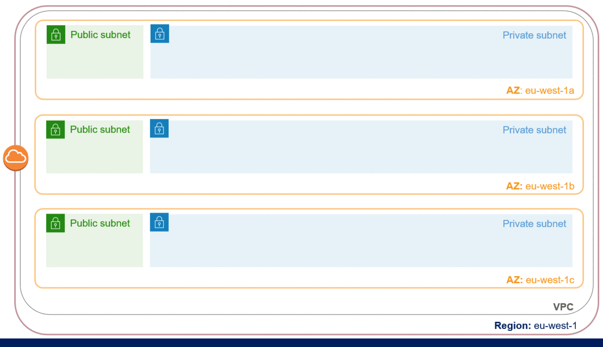

# Design and implementation of a cloud-based service for remote monitoring of IoT devices
The entire project was developed using all open-source technologies to reduce costs and increase the portability of the service to other cloud platforms.

### Overview
The purpose of this thesis project is to design, build and test a cloud architecture capable of providing a reliable, available, performing and resilient service, by leveraging scalability and flexibility without the limitations imposed by the physical constraints of local servers, take advantage of the reliability of multiple data centers with numerous redundancies, customization by configuring servers according to preferences and a balancing service reactive load able to adapt quickly to changes in demand.

### Technologies involved
* [Amazon Web Services](https://aws.amazon.com/it/) 
* [Python](https://www.python.org/) 
* [Prometheus](https://prometheus.io/) 
* [GridDB](https://griddb.org/) 
* [Docker](https://www.docker.com/) 
* [VerneMQ](https://vernemq.com/) 
* [Grafana](https://grafana.com/)

### Architecture

### Demo

